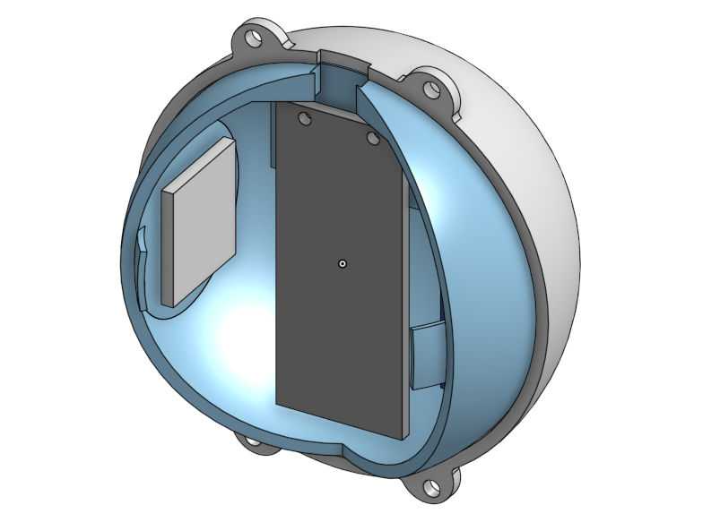

# Pi in the Sky Projectile
Lucy Gray Pi in the Sky Project Engineering 4

## Table of Contents
* [Planning](https://github.com/lgray52/Pi-in-the-Sky_Projectile/blob/main/README.md#planning)
* [CAD](https://github.com/lgray52/Pi-in-the-Sky_Projectile/blob/main/README.md#cad)
* [Code](https://github.com/lgray52/Pi-in-the-Sky_Projectile/blob/main/README.md#code)

### Planning

The projectile will be launched from a [trebuchet](https://github.com/lgray52/CapstoneProject), so it needs high survivability. The goal is for Mr. Manning to be able to use the projectile to demonstrate projectile motion in his physics classes, so it also needs to be able to take measurements while it is in the air and with a high degree of accuracy. It also needs to weigh a maximum of 6.4oz or 181.44g because of the counterweight limit of the trebuchet, and ideally would be no wider than a standard-sized tennis ball, with a diameter of 6.86cm, to fit through the trebuchet's guide chute. 

<b> Preliminary Exterior Diagram </b>

<b> Preliminary Interior Diagram </b>

I still have some different ideas about how different aspects of the project will work. The main concern is survivability, and hopefully, I will be able to use a squishy 3D-printed material to minimize damage to the shell on impact. However, having an exterior that squishes might create difficulties with the wiring and circuit boards as it could damage interior circuitry. Suspending the electrics with respect to each, for example by having springs between them, could potentially protect from this damage. Depending on the level of squish, padding between different elements might be sufficient. 

<b> Problems and Solutions Brainstorming </b>

<b> Code Block Diagram </b>

<b> Safety </b>

The projectile will experience high impact speeds, so it's important it doesn't smash into a million pieces on impact. In order to ensure this, controlled tests will be conducted by dropping/throwing it from heights and making sure the shell is thick enough not to break. The use of squishy material will also help this. The rest of the safety concerns are all trebuchet launch related - people will need to stand away from the swinging arm. 

<b> Materials </b>

I expect this project will require:

* Raspberry Pi Pico (1x)
* Altimeter (x1)
* Gyroscope (x1)
* 3D-printer material (enough for a 6.86cm diameter sphere of probably about 2.5mm thickness)
* Screws for putting the shell together
* Custom soldered circuit boards to mount electronics on

<b> Schedule </b>

* Deadline: April 1
  * CAD done by end of January
  * Code done by middle of February
  * All prints and circuit boards done by end of 1st week of March
  * Assembly and durability testing throughout March
  * Finished by April 1
* Iteration and fixes

## CAD

The primary challenge is to fit all of the electrical components into a sphere the size of a tennis ball and keep everything under the 181g weight limit while designing it to be structurally sound enough to survive repeated impacts. In the design process, I decided to make a dual-layer design with squishy TPU on the outside and rigid PLA on the inside. This way, the impact stress will be absorbed by the outer layer while the electronic components on the inside will not be squished or smashed against one another. To fit the circuit boards in, I created flat faces perdendicular to the direction the Pico will be suspended to allow all the components to fit in properly. There will also be room for a powerboost and internal padding.

<b> CAD Design </b>

   

## Code

### Starting the code

The first big issue I had to address was starting the data collection sequence of the projectile. I decided to try to communicate between two Pico boards to send a signal from one to the other to start and stop data collection using a button attached to the iniator board. I originally discovered [this library](https://github.com/kevinmcaleer/easy_comms), then realised it was written in MicroPython, making it incompatible with the CircuitPython I am using in the rest of the project. Since MicroPython and CircuitPython are quite similar in many regards, I tried to translate the library to CircuitPython, but it quickly became clear it would be easier to use code written in CircuitPython. Based on the Easy Comms library, I was able to narrow my search to a CircuitPython-based UART-reliant communication system, which I found [here](https://learn.adafruit.com/circuitpython-essentials/circuitpython-uart-serial). This example code was very useful to build a sending and receiving code operating over UART. [Here](https://github.com/lgray52/Pi-in-the-Sky_Projectile/blob/main/code/uartTest.py) is the test code I wrote and am using to structure future comms.

### Adapting reading message into library

One issue I had with the code above is that, while functional, the section which is able to retrieve a message is long and a little bit clunky since it's reading the message one byte at a time and stringing it together letter by letter. I decided to put it into a function so I could use it repeatedly, bunt unfortunately the stringing the message together relies on a loop. A loop inside a function is a slippery slope to figure out since its easy to accidentally get stuck inside a loop within a function, so I decided to try a different approach by reading more bytes over the line. I found the very handy decode() method which turns bytes into a string which is the ideal output, allowing me to simplify the message-getting approach significantly. 
