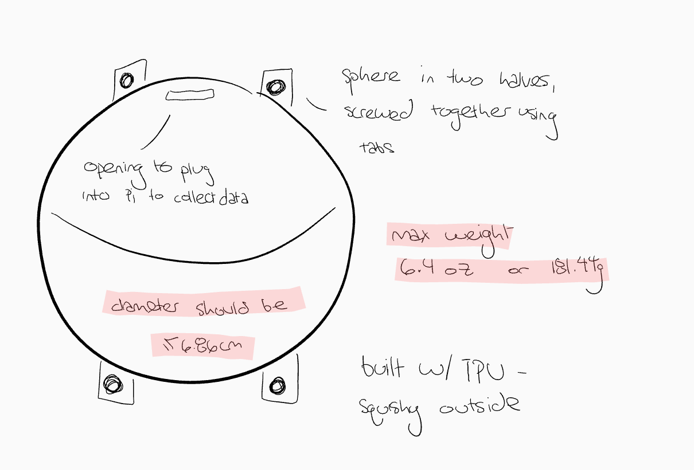
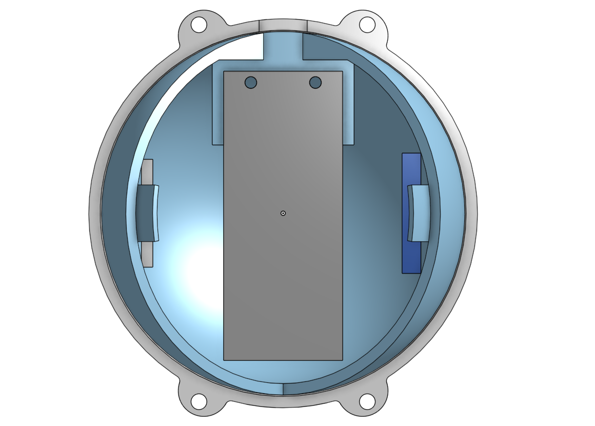

# Pi in the Sky Projectile
Lucy Gray Pi in the Sky Project Engineering 4


## Table of Contents
* [Planning](https://github.com/lgray52/Pi-in-the-Sky_Projectile/blob/main/README.md#planning)
* [CAD](https://github.com/lgray52/Pi-in-the-Sky_Projectile/blob/main/README.md#cad)
* [Code](https://github.com/lgray52/Pi-in-the-Sky_Projectile/blob/main/README.md#code)
* [Physical](https://github.com/lgray52/Pi-in-the-Sky_Projectile/blob/main/README.md#physical)

### Planning

The projectile will be launched from a [trebuchet](https://github.com/lgray52/CapstoneProject), so it needs high survivability. The goal is for Mr. Manning to be able to use the projectile to demonstrate projectile motion in his physics classes, so it also needs to be able to take measurements while it is in the air and with a high degree of accuracy. It also needs to weigh a maximum of 6.4oz or 181.44g because of the counterweight limit of the trebuchet, and ideally would be no wider than a standard-sized tennis ball, with a diameter of 6.86cm, to fit through the trebuchet's guide chute. 

<b> Preliminary Exterior Diagram </b>



<b> Preliminary Interior Diagram </b>


I still have some different ideas about how different aspects of the project will work. The main concern is survivability, and hopefully, I will be able to use a squishy 3D-printed material to minimize damage to the shell on impact. However, having an exterior that squishes might create difficulties with the wiring and circuit boards as it could damage interior circuitry. Suspending the electrics with respect to each, for example by having springs between them, could potentially protect from this damage. Depending on the level of squish, padding between different elements might be sufficient. 

<b> Problems and Solutions Brainstorming </b>


<b> Code Block Diagram </b>


<b> Safety </b>

The projectile will experience high impact speeds, so it's important it doesn't smash into a million pieces on impact. In order to ensure this, controlled tests will be conducted by dropping/throwing it from heights and making sure the shell is thick enough not to break. The use of squishy material will also help this. The rest of the safety concerns are all trebuchet launch related - people will need to stand away from the swinging arm. 

<b> Materials </b>

I expect this project will require:

* Raspberry Pi Pico (1x)
* Altimeter (x1)
* Gyroscope (x1)
* 3D-printer material (enough for a 6.86cm diameter sphere of probably about 2.5mm thickness)
* Screws for putting the shell together
* Custom soldered circuit boards to mount electronics on

<b> Schedule </b>

* Deadline: April 1
  * CAD done by end of January
  * Code done by middle of February
  * All prints and circuit boards done by end of 1st week of March
  * Assembly and durability testing throughout March
  * Finished by April 1
* Iteration and fixes

[Back to Table of Contents](https://github.com/lgray52/Pi-in-the-Sky_Projectile/blob/main/README.md#table-of-contents)

## CAD

I used OnShape to model all parts.

### Projectile
The primary challenge for the projectile is to fit all of the electrical components into a sphere the size of a tennis ball and keep everything under the 181g weight limit while designing it to be structurally sound enough to survive repeated impacts. In the design process, I decided to 3D print a sphere using a dual-layer design with squishy TPU on the outside and rigid PLA on the inside. This way, the impact stress will be absorbed by the outer layer while the electronic components on the inside will not be squished or smashed against one another. To fit the circuit boards in, I created flat faces perdendicular to the direction the Pico will be suspended to allow all the components to fit in properly. There will also be room for a powerboost and internal padding.

   

*[Projectile CAD](https://cvilleschools.onshape.com/documents/8d3a5e693f3cf33ca7e5bdc1/w/83808f7c6e04da8df33e76c7/e/95c830c3264aed7347df3daa?renderMode=0&uiState=645e76d238eafd55bede0946)*

### Control Box
I also designed a control box to store the electronics which will be able to arm the projectile and print the returned launch data to a screen. I added this aspect to my original design as a solution for the transmission of information from the projectile. The design of this box was simple, and my only real requirement was that it could be easily handheld and easy for Mr. Manning to use. For this reason, instructions will also be etched on the side of the box to make the usage of the control box crystal clear. I made the control box to be cut out of acrylic with the laser cutter.

      

*[Control Box CAD](https://cvilleschools.onshape.com/documents/8d3a5e693f3cf33ca7e5bdc1/w/83808f7c6e04da8df33e76c7/e/e94914d4094986ac800e3476?configuration=List_tYLpmbiOPNIlMj%3DDefault&renderMode=0&uiState=645e76f938eafd55bede0a2a)*

[Back to Table of Contents](https://github.com/lgray52/Pi-in-the-Sky_Projectile/blob/main/README.md#table-of-contents)

## Code
*All code written in CircuitPython for Raspberry Pi Pico boards*

[↓ Jump to final code and wiring ↓](https://github.com/lgray52/Pi-in-the-Sky_Projectile/blob/main/README.md#final-code)

### Starting the code

The first big issue I had to address was starting the data collection sequence of the projectile. I decided to try to communicate between two Pico boards to send a signal from one to the other to start and stop data collection using a button attached to the iniator board. I originally discovered [this library](https://github.com/kevinmcaleer/easy_comms), then realised it was written in MicroPython, making it incompatible with the CircuitPython I am using in the rest of the project. Since MicroPython and CircuitPython are quite similar in many regards, I tried to translate the library to CircuitPython, but it quickly became clear it would be easier to use code written in CircuitPython. Based on the Easy Comms library, I was able to narrow my search to a CircuitPython-based UART-reliant communication system, which I found [here](https://learn.adafruit.com/circuitpython-essentials/circuitpython-uart-serial). This example code was very useful to build a sending and receiving code operating over UART. [Here](https://github.com/lgray52/Pi-in-the-Sky_Projectile/blob/main/code/uartTest.py) is the test code I wrote and am using to structure future comms.


### Adapting reading message into function library

One issue I had with the code above is that, while functional, the section which is able to retrieve a message is long and a little bit clunky since it's reading the message one byte at a time and stringing it together letter by letter. The purpose of doing this in the original code is to designate responses by the message type based on a one-letter key at the beginning of a message, a functionality which is not needed in my code. I decided to put the message-reading section in a function so I could use it repeatedly, but unfortunately the stringing the message together relies on a loop. A loop inside a function is a slippery slope to figure out since its easy to accidentally get stuck inside a loop within a function, so I decided to try a different approach by reading more bytes over the line. I found the very handy decode() method which turns bytes into a string which is the ideal output, allowing me to simplify the message-getting approach significantly. Here is the finished function:

``` python
from time import sleep

def getMessage(uart):
    message = 0

    byte_read = uart.read(40)  # Read a bunch of bytes to make sure it gets the whole message
    sleep(.2)  # make sure it has enough tine to read the whole message while not causing awkward delay

    if not byte_read:  # Nothing read.
        pass

    if byte_read:
        message = byte_read.decode()  # decode bytes into a string
        print(f"Message received: {message}") 
    
    return message
```


### Finding the maximum height values and eliminating outliers in the data

Since I am going to need to be able to find a reliable measurement of maximum height, I decided I needed to write a short function to separate out outliers since the data from the altitude sensor is prone to random spikes. CircuitPython makes it very easy to find a maximum value with the max() method, so I just had to figure out how to reove outliers using statistics with the very handy ulab/"micro lab" (which allows many features of numpy, a very very useful library for anything beyond basic math, to work in CircuitPython). I tried this using mean first, but big outliers skewed the mean significantly and threw the maximum data point off, so I switched over to median. Below is the completed function. 

``` python
from ulab import numpy as np

def findMax(vals):
    real_vals = []
    medianVal = np.median(vals)
    devs = []

    for d in range(len(vals)):  # make a list of all the deviations from the median (mean ends up too skewed)
        devs.append(vals[d] - medianVal)
    
    deviation = np.sqrt((sum(devs))/len(vals))  # add them up and find the standard deviation

    for i in reversed(range(len(vals))):  # cycle backward through list so as not to mess up indices
        zScore = (vals[i]-medianVal)/deviation  # find the z-score (how far removed from the data it is) based on median

        if zScore <= 3:  # add all close enough vals to real vals list, excluding outliers > 3 stdevs from the median
            real_vals.append(vals[i])

    maxVal = max(real_vals)
    
    return maxVal
```

### Passing the maximum value back to the control box

This was unexpectedly very challenging since I didn't have a system in place for catching a message at a specific moment in the code when it was sent. All of the previous messages I needed to send contained specific text that I was using as an activation key, whereas the maximum value is a number that will vary from launch to launch. This meant that I couldn't employ the tactic of just running a "while True" loop and looking for the message to be a specific sentence. Instead, I had an activation key sent back and forth to ready both boards and then catch the message by reading bytes until the beginning of the message (a filler character) is detected, after which it catches the max height. This very nearly worked, but it seems that the UART spits over messages extremely quickly so almost 50% of the time the message it was catching was a zero. The solution I came up with is causing it to enter a while loop to keep looking for the real message if the message it gets is "0". I don't anticipate this will be a problem because if the measured max height is ever actually zero, I will have much bigger issues than transmitting the max height. This works quite well and prints nicely to the screen. 

<table>
<tr>
<th align="center">

<p> 
<small>
PROJECTILE CODE
</small>
</p>
</th>
<th align="center">

<p> 
<small>
CONTROL BOX CODE
</small>
</p>
</th>
</tr>
<tr>
<td>

```python
uart.write(bytes(f"Sending max height...", "ascii"))  
# send sender a message to prepare to receive max height
message = getMessage(uart)

while message == 0:  
# wait until message is sent back over that sender is ready to receive
    message = getMessage(uart)  # continue to check message

if message == "Ready for max height":  
# when confirmation is received, send max height
    uart.write(bytes(f" {str(max)}", "ascii"))  
    # need to add one space before message so that it can read 
    # that a byte is sent before getting the whole message
```
  
</td>
<td>
  
```python
if getMessage(uart) == "Sending max height...":  
# wait for message which tells sender to prepare to receieve max height
    waitForMax = True
else:
    waitForMax = False

if waitForMax:  # tell receiever the sender is ready
    uart.write(bytes(f"Ready for max height", "ascii"))
    waitForMax = False

    byte_read = uart.read(1)

    while byte_read == None:  
        # read one byte at a time until it 
        # gets a message which isn't None
        byte_read = uart.read(1)

    maxHeight = getMessage(uart)  
    # read the message after the first detected byte

    while maxHeight == 0:  
        # max height almost certainly should not be zero -
        # correct transmission skip
        maxHeight = getMessage(uart)

    maxStr = f"Max height: {maxHeight}m"  
    # set as var to pass to serial and the oled screen
```
</td>
</tr>
</table>


### Finding the time of flight

Upon talking with Mr. Manning, I decided to include a timing function. My initial idea is to use time.monotonic() to measure the amount of time in a state of freefall between major accelerations. I briefly considered including a timer on the control box when this code was not working, but on debugging my initial code I realized it would work as I thought. The MPU accelerometer I'm using is calibrated so that freefall constitutes an acceleration of zero, so if the projectile knows it has not been launched (has not experienced freefall) that it should be looking for when it enters freefall to tell when it is launched. Once it knows it has been launched, it should be looking for when it experiences an acceleration from hitting the ground, which will be larger than the acceleration due to gravity (about 9.8 $m/s^2$ but usually between 8 and 11 in the accelerometer's readings). This allows what seems to be a fairly accurate time of flight, but I will probably need to test this code headless since dropping my circuit board from the table to a chair is not far enough to see whether or not the time value is consistent. Proof of concept code [here](https://github.com/lgray52/Pi-in-the-Sky_Projectile/blob/main/code/accelTest.py).

### Sending the time of flight to the board
The last obstacle I had was combining the time of flight code with the main projectile code and sending it to the control box. When I combined the time of flight code with the code which collected altimeter values, I noticed that the acceleration values collected much slower than when the acceleration code is isolated. I realized that this is because the altimeter values collect quite slowly to get more accurate values. With Mr. Miller's help, I found [the GitHub for the MPL altimeter](https://github.com/adafruit/Adafruit_CircuitPython_MPL3115A2/blob/main/adafruit_mpl3115a2.py) and was able to adjust the speed with which the altimeter collects data by modifying the collection rate in the library at line 150 in the GitHub document. This done the acceleration collects a little faster, allowing me to test the combination of max height and time of flight transmission. Sending the data was fairly straight forward since I was able to modify the code I had already written to transmit the max height to include a section for the time of flight, as shown below.

<table>
<tr>
<th align="center">

<p> 
<small>
PROJECTILE CODE
</small>
</p>
</th>
<th align="center">

<p> 
<small>
CONTROL BOX CODE
</small>
</p>
</th>
</tr>
<tr>
<td>

```python
"""send data to control box"""
uart.write(bytes(f"Sending data...", "ascii"))
message = getMessage(uart)

while message == 0:  # keep checking for message
    message = getMessage(uart)
        
# will send max cue first and then time
if message == "Ready for max height": 
    uart.write(bytes(f" {str(max)}", "ascii")) 

message = getMessage(uart)

while message == 0:  # keep checking for message
    message = getMessage(uart)

# send the time cue
if message == "Ready for time":
    uart.write(bytes(f" {str(totalTime)}", "ascii"))
```
  
</td>
<td>
  
```python
if getMessage(uart) == "Sending data...":  
    # wait for message which prompts to prepare for max height
    waitForData = True
else:
    waitForData = False

if waitForData:  # tell receiever the sender is ready
    uart.write(bytes(f"Ready for max height", "ascii"))
    waitForData = False

    byte_read = uart.read(1)

    while byte_read == None:  
        # read one byte until it gets a message which isn't None
        byte_read = uart.read(1)

    maxHeight = getMessage(uart)  
    # read the message after the first detected byte

    while maxHeight == 0:  
        # this corrects a transmission skip problem
        maxHeight = getMessage(uart)
    # record max height
    maxStr = f"Max height: {maxHeight}m"

    # Time of flight
    uart.write(bytes(f"Ready for time", "ascii"))
        
    byte2_read = uart.read(1)

    while byte2_read == None:  # same strategy as above
        byte2_read = uart.read(1)
        
    tof = getMessage(uart)

    while tof == 0:
        tof = getMessage(uart)
    # record time of flight
    tofStr = f"Time: {tof}s"
```
</td>
</tr>
</table>

### Final Code

* [Function library](https://github.com/lgray52/Pi-in-the-Sky_Projectile/blob/main/code/projectileLib.py)
* [Code for control box](https://github.com/lgray52/Pi-in-the-Sky_Projectile/blob/main/code/commsControl.py)
* [Code for projectile](https://github.com/lgray52/Pi-in-the-Sky_Projectile/blob/main/code/commsProjectile.py)

### Wiring Diagram

Note: both will also have wires from the RX and TX pins from one to the other as well as a common ground.

<table>
<tr>
<th align="center">

<p> 
CONTROL BOX
</p>
</th>
<th align="center">

<p>
PROJECTILE
</p>
</th>
</tr>
<tr>
<td>
 


<sup><sub> Reset pin will be connected to GP5. </sub></sup>
</td>
<td>


<sup><sub> The MPL altimeter is here represented by an MPU accelerometer - their wiring is the same. </sub></sup>
</td>
</tr>
</table>

[Back to Table of Contents](https://github.com/lgray52/Pi-in-the-Sky_Projectile/blob/main/README.md#table-of-contents)

## Physical

<b> Box </b>

 

<b> Projectile </b>

  

The physical assembly of the projectile and control box have gone very smoothly. The only major assembly points were soldering the Pico for the control box onto my circuit board and soldering the components for the projectile to the projectile Pico. There is exactly enough space for the powerboost and a small lipo battery inside the projectile, and the shell held up very well with tabletop height drops. The thickness of the shell and the use of TPU for the outer shell lends it what I believe will be excellent survivability. The control box also came together well, although I did modify the design slightly from the original to remove the on/off switch as the battery holder I found has its own. 

<b> Materials</b>

I ended up using...

* Raspberry Pi Pico (2x)
* Altimeter (x1)
* Gyroscope (x1)
* OLED screen (x1)
* Button (x1)
* Battery pack (x1 for projectile and x1 for control box with built in on/off switch)
* 3D-printer material (enough for a 6.86cm diameter sphere of probably about 2.5mm thickness - both squishy and solid material)
* Acrylic for control box
* Screws
* Wires
* Custom soldered circuit boards to mount electronics on

[Back to Table of Contents](https://github.com/lgray52/Pi-in-the-Sky_Projectile/blob/main/README.md#table-of-contents)

### Issues
<b> Message error</b>

The main issue I ended up running into was a strange error in the transmission. When I unplugged the projectile from the box, it turned out that the projectile was receiving a completely blank message. It took me a while to figure out what was going wrong - my first thought was that touching the wires was throwing the transmission off. However, the problem persisted even when I got a system working to plug the projectile to the box with headers, so the problem was not actually touching the wires. As it turned out, unplugging the two Picos was throwing the projectile's board an unreadable byte sequence. Because it couldn't translate it, the message it was throwing the board was neither nothing nor zero, the two things that the code was looking for to keep collecting data. I was able to filter out these unredable bytes in the message receiving function, and so far that has worked quite well.

<b> First Test "Launches" </b>

Once I was able to get the minor issues out of the way, I was able to do a couple test "launches" in the lab. By throwing the projectile up, I was able to get data and send it to the control box. It printed properly, so I hope I will be able to launch from the trebuchet very soon!

[Back to Table of Contents](https://github.com/lgray52/Pi-in-the-Sky_Projectile/blob/main/README.md#table-of-contents)
